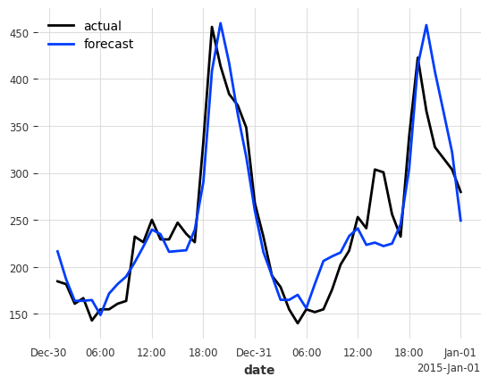

# occuPi - University of Illinois Research Park Hackathon 2024

Occupi - near real-time and forecasted room occupancy using edge computing and zero-shot transfer learning.

## Team Name: Agco x Ameren

### Members

Samuel Gerstein, Caleb Larson, Angie Lewis, Atharva Naik, Rishab Tirupathi

### Problem

We often see people in libraries at UofI counting the number of people in the library via a clicker. The all-to-familiar clicking noise passing the hall every hour is well known across students. This utilises a lot of manpower and manual labour, which could be used for other more productive activities. Additionally, during times of high traffic to the library (before breaks and around finals), it is hard to know whether there is avaiable seating now, or in the future.

### Proposed Solution

The solution is to combine sensors and predictive modeling to showcase what the current capacity of the building is, and what the future is likely to be. This enables students to better plan when to reach the library, and whether or not it is worth their time.

To forecast for occupancy in a room, we are using transfer learning with zero-shot predictions. We train a [TiDE model](https://arxiv.org/abs/2304.08424) on the first home in the UCI Electricity Dataset which collects hourly electric usage. The size of the lookback window/input chunk is 4 days, and the model can predict 24 hours at once. We test for a horizon of 48 hours by generating predictions autoregressively. This results in an MAE of 25.71 kW. We also explored simply using Linear Regression on the Air Passengers dataset for transfer learning.



We then host the model so that it can communicate with the Raspberry Pi through an API we built.

### Future Work

 We hope to also implement a recommendation system that provides recommendations for nearby UIUC buildings (like the ARC, Grange Grove, etc) with sufficient capacity. 

### website link

 final link here  
 ### Process 
Angie 
Caleb 
Atharva 
Sam 
Rishab

## System Architecture


### figma final design link (Future steps)
https://www.figma.com/design/jqPVaCqANmeKBIrWMTB5vH/agco-ameren-hackathon?node-id=0-1&t=5QMZqTV9jB70VagN-1
### figma desktop mockup (Future steps)
https://www.figma.com/proto/jqPVaCqANmeKBIrWMTB5vH/agco-ameren-hackathon?page-id=0%3A1&node-id=18-212&viewport=1876%2C-3487%2C0.47&t=DtgSPgIxJfiP2O6o-1&scaling=scale-down&content-scaling=fixed

## Repository setup

We recommend creating a [python virtual environment](https://docs.python.org/3/tutorial/venv.html) to silo dependencies for the project.

```
pip install -r requirements.txt
```

You will also need a Google Cloud JSON key (specifically for Firestore) that you
can store in a `.env` file structured as follows:

```
CREDENTIALS_JSON=<path_to_credentials>
```
